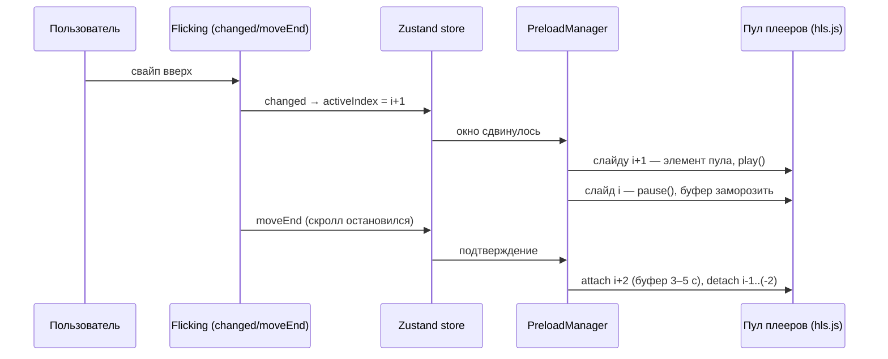
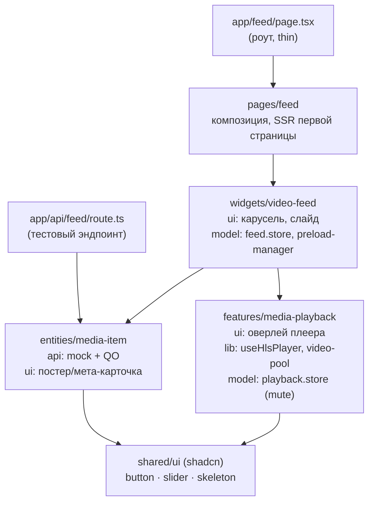

# План реализации: вертикальная лента видео-контента

Mobile-first страница с вертикальной лентой видео (аналог TikTok / Reels / Shorts):
скролл по одному элементу, автовоспроизведение активного, предзагрузка следующих.

Документ — технический план: выбор инструментов, архитектура, стратегии. Ключевые
решения оформлены как «Вариант A / B»; выбранные варианты зафиксированы,
альтернативы оставлены как обоснование.

## Контекст: стек темплейта

Next.js 16 (App Router, React 19, React Compiler), TypeScript, Feature-Sliced Design,
TanStack React Query v5, shadcn (Base UI, стиль base-nova), Tailwind v4, Biome, Vitest,
Playwright.

Принцип плана: **минимум кастомных решений** — берём поддерживаемые библиотеки и
готовые shadcn-компоненты, свой код пишем только там, где он и есть суть задачи
(оркестрация預загрузки и жизненный цикл плееров).

Новые зависимости (по зафиксированным вариантам):

| Пакет | Зачем | Статус (авг 2026) |
|---|---|---|
| `hls.js` | HLS-плеер поверх MSE/MMS | v1.6.x, эталон, активно живёт |
| `@egjs/react-flicking` | движок ленты: строгий «1 за жест», вертикаль, `renderOnlyVisible` (ограниченный DOM) | v4.16.6, Naver, релизы июля 2026, React 19 патчен |
| `zustand` | клиентский стор | v5.0.x |

---

## 0. Ключевые выборы

### Выбор 1 — механизм ленты (скролл/снэп + виртуализация)

Жёсткое требование: лента переживает **1000+ элементов за сессию без деградации** —
DOM и память ограничены константой, а не длиной истории скролла.

**Вариант A — выбран: Flicking (`@egjs/react-flicking`).**

Единственная найденная библиотека, закрывающая все три требования сразу (глубокий
ресёрч + полная зачистка экосистемы — см. «Отвергнуто»):

- **`moveType: "strict"`** — жёсткая гарантия «один элемент за жест» на уровне
  движка, при любой силе флика; документированный, рекомендованный мейнтейнером
  режим.
- **`renderOnlyVisible`** — ограниченный DOM: что монтировать, решает обычная
  React-реконсиляция, в DOM живёт `panelsPerView + 1` панелей; панели — полноценные
  React-деревья (плеер, хуки, оверлей). Инфинит-append — обычный React-state поверх
  страниц React Query, без спец-API.
- Вертикаль (`horizontal: false`) — first-class режим; JS-управляемый drag обходит
  iOS-болячки нативного CSS scroll-snap (rubber-banding, проскок снэпа).
- Активный элемент — событие `changed`, «скролл остановился» — `moveEnd`;
  IntersectionObserver не нужен.
- Поддержка: Naver, релизы июля 2026, React 19 патчен в 4.16.x. ~42 КБ gzip.

Известные риски — закрываются ранним спайком (этап 2):

- `renderOnlyVisible` — самый свежепатченный угол либы (фиксы `removePanel`/жестов
  в июле 2026); комбинация vertical + renderOnlyVisible + инфинит-append +
  video-панели публичных прецедентов не имеет.
- Колесо/тачпад: `WheelInput` в актуальном `@egjs/flicking-plugins` (4.8.1)
  отсутствует — проверено по декларациям на спайке; колесо закрывает свой тонкий
  `onWheel`-хендлер поверх `next()/prev()`. Единственный кастомный кусок жестов.
- Флеш ориентации при SSR в Next
  ([naver/egjs-flicking#615](https://github.com/naver/egjs-flicking/issues/615)) —
  митигируем клиентским маунтом контейнера (раздел 2).
- Провал спайка → откат на вариант B: плеер/предзагрузка/стор от механизма ленты
  не зависят, пересматривается только виджет.

**Итог спайка (этап 2): Flicking подтверждён.** `renderOnlyVisible` требует двух
неочевидных контрактов, оба найдены на спайке и зафиксированы в коде:
`panelsPerView >= 1` (при -1 опция молча игнорируется) и проброс `ref` на корневой
DOM-узел компонента панели — StrictPanel обёртки инжектит ref клонированием
(после выпила `findDOMNode` ради React 19), без него движок видит `element: null`:
размеры панелей 0, камера съезжает на полпанели, culling мёртв. После фиксов:
в DOM 1–2 панели при любой длине ленты, шаг строго «1 за жест», append бесшовный.

**Вариант B (запасной): нативный CSS scroll-snap + spacer-виртуализация руками.**

- `scroll-snap-type: y mandatory` + `scroll-snap-stop: always` (baseline, iOS 15+,
  запрещает пролетать снэп-точки) + два спейсера и окно реальных элементов в
  нормальном потоке (~110 строк, высоты одинаковые — без замеров). Ноль
  зависимостей; совпадает с prior art веб-реализаций TikTok-лент.
- Но: активный элемент считаем сами (IO + `scrollend`; `scrollsnapchange` не
  baseline), «1 за жест» на колесе гарантирован слабее, iOS rubber-banding на
  краях — руками.

**Отвергнуто (по результатам ресёрча):**

- **Swiper Virtual** — связка vertical + Virtual + Mousewheel — каталог живых багов
  ([#7243](https://github.com/nolimits4web/swiper/issues/7243),
  [#4668](https://github.com/nolimits4web/swiper/issues/4668)); инфинит-append при
  Virtual flaky ([#7580](https://github.com/nolimits4web/swiper/issues/7580),
  [#3216](https://github.com/nolimits4web/swiper/issues/3216)); `swiper/react`
  официально идёт к удалению, web-component-путь наследует те же баги ядра.
- **shadcn Carousel / Embla** — первоначальный выбор, снят после фиксации
  требования 1000+: виртуализации нет, оболочки копятся в DOM, append страницы
  делает `reInit` O(n) (деградация от ~500 слайдов); окно оболочек поверх Embla —
  борьба с движком.
- **Библиотеки виртуализации** (virtua / react-virtuoso / tanstack-virtual) + CSS
  snap — архитектурный конфликт: transform-позиционирование ломает снэп-точки
  ([TanStack/virtual#478](https://github.com/TanStack/virtual/issues/478)).
- **Зачистка остального**: fullpage.js (GPLv3/платная лицензия, без виртуализации);
  react-page-scroller / react-full-page / keen-slider / Glide (заброшены); Splide и
  Shoelace `<sl-carousel>` (вертикаль есть, виртуализации нет); свежие
  «tiktok-feed»-пакеты (тонкие обёртки без окна DOM). Другого готового владельца
  механизма в экосистеме нет.

### Выбор 2 — слой воспроизведения

**Вариант A — выбран: `hls.js` напрямую на `<video>` + тонкий хук `useHlsPlayer`.**

- Вся стратегия предзагрузки (раздел 3) строится на тонком контроле буфера
  (`maxBufferLength`, `startLevel`, `destroy()`); hls.js — эталонная реализация,
  любая обёртка этот контроль только прячет.
- v1.6+ поддерживает ManagedMediaSource → **настоящий ABR на iPhone Safari 17.1+**
  (у TikTok web там исторически прогрессивный MP4).
- Идеален для пула из 3–5 переиспользуемых `<video>`: мы сами владеем attach/detach.
- UI-обвязка не нужна — оверлей рисуем shadcn-компонентами.
- Хук ~60–80 строк — это «кастом», который и есть предмет задачи.

**Вариант B: media-chrome + `<hls-video>` (стек Mux).** Ещё меньше своего кода
(web-component сам управляет hls.js, media-chrome даёт доступные контролы-примитивы);
Mux публично разбирали именно TikTok-фид. Минусы: web-components поверх React 19 —
лишний слой косвенности, буфер-конфиг через пропсы-passthrough, контролы мы всё равно
рисуем shadcn'ом. Хороший план Б.

Отвергнуто: `vidstack` (жирнее, React 19-совместимость свежая, контроль буфера через
прослойку), `react-player` (мульти-провайдерная абстракция не нужна), `plyr`
(maintenance-mode, навязывает свой скин).

### Выбор 3 — клиентский стор

**Вариант A — выбран: Zustand v5.** Плоское UI-состояние (activeIndex, mute/volume,
viewed-set, режим預загрузки) — ровно его ниша: атомарные селекторы против лишних
ре-рендеров, `getState()` вне React (в колбэках Embla/hls), `persist` для mute,
~1 КБ. React Query остаётся для серверного состояния — границу не смешиваем.

**Вариант B: без стора** — React Query + локальный state + контекст. Возможно, но
activeIndex/mute нужны множеству слайдов сразу: контекст даст каскадные ре-рендеры,
придётся городить мемо-обвязку — кастома больше, чем от Zustand.

### Нерешаемые выборы (следуют из контекста)

- **Данные ленты** — React Query `useInfiniteQuery` (уже в стеке), cursor-пагинация,
  страницы append-only (обоснование в разделе 3). Тестовый эндпоинт
  `GET /api/feed` (Route Handler) поверх детерминированного генератора в
  entity-слое; ссылки — публичные HLS-потоки строго с CORS (`test-streams.mux.dev`,
  Unified Streaming; Apple devstreaming CDN отпал — не отдаёт
  `Access-Control-Allow-Origin`, а hls.js качает манифесты XHR'ом).
- **Активный элемент** — событие `changed` Flicking; IntersectionObserver не нужен.
- **UI** — shadcn-компоненты, ставятся точечно на том этапе, где реально
  используются (`pnpx shadcn add <component>`); иконки Lucide.

---

## 1. Видео/медиа: форматы, плеер, буферизация

### Транспорт: HLS (fMP4/CMAF)

- **Почему не прямой MP4**: браузер сам решает, сколько качать (`preload` — лишь
  подсказка), нет адаптивного битрейта, у соседних элементов нельзя ограничить буфер
  «3 секунды и стоп». Для ленты это перерасход сети и памяти.
- **HLS**: сегменты по 2–4 с, ABR-лестница (напр. 240p/480p/720p/1080p), старт с
  низкого качества (`startLevel: 0` или capped) → первый кадр за сотни миллисекунд,
  качество догоняет со 2-го сегмента. Так делают TikTok/Reels.
- Кодеки: H.264 — база; HEVC/AV1-лестницы, где `mediaCapabilities` подтверждает
  аппаратный декод (экономия ~30–50% трафика). Это ответственность паковщика на
  бэке; фронт лишь выбирает вариант манифеста.

### Движок: hls.js через MSE / ManagedMediaSource

| Платформа | Путь |
|---|---|
| Chrome/Firefox/Edge/Android | hls.js поверх MSE |
| iOS Safari 17.1+ | hls.js поверх **ManagedMediaSource** — полный контроль ABR/буфера |
| Старые iOS | нативный HLS (`video.src = m3u8`) — fallback без тонкого контроля |

### Пул `<video>`-элементов

3–5 переиспользуемых элементов (active, next, prev [, +2]), а не элемент на слайд:
у мобильных браузеров жёсткие лимиты одновременных декодеров, iOS убивает страницы
с десятками живых media-элементов. Слайд получает элемент из пула при входе в окно
предзагрузки и отдаёт при выходе (`hls.detachMedia()`, `video.removeAttribute('src')`,
`video.load()`). Прогрев соседей идёт в скрытых элементах пула вне панелей ленты —
MSE-буфер не требует присутствия элемента в DOM, поэтому ограниченный DOM
`renderOnlyVisible` предзагрузке не мешает.

### Autoplay и звук

`muted` + `playsInline` — иначе мобильные браузеры не дадут автоплей. Глобальный
mute в сторе (persist): первый тап по звуку включает его для всей ленты. Обработка
отказа `video.play()` (promise rejection) → остаёмся на постере с кнопкой.

### Постер / первый кадр

Слайд до готовности видео показывает постер (в проде — thumbnail из бэка + LQIP/blur;
в прототипе — заглушка/skeleton, тестовые стримы постеров не дают). `preload="none"`
на элементе — всю предзагрузку ведёт hls.js по нашей стратегии, не браузер.

## 2. Механизм скролла

Flicking, `horizontal: false`, панели `h-dvh` (учитывает схлопывание адресной
строки), `moveType: ["strict", { count: 1 }]`.

- **Тач**: drag-движок Flicking — «один жест = одна панель» гарантирует движок,
  при любой силе флика.
- **Десктоп-колесо/тачпад**: свой тонкий хендлер `onWheel` → `next()/prev()` по
  знаку дельты с кулдауном (`WheelInput` в `@egjs/flicking-plugins` 4.8.1 не
  существует — проверено по декларациям). Инерция тачпада — известная тонкая точка
  любого wheel-снэпа, тюнинг по ручной проверке.
- **Клавиатура**: ArrowUp/Down → `flicking.prev()/next()` — пара строк, модуль
  не нужен.
- **Виртуализация**: `renderOnlyVisible` — в DOM `panelsPerView + 1` панелей;
  данные панелям отдаёт список из страниц React Query.
- **Активный элемент**: `changed` → `store.setActiveIndex(i)`;
  `moveEnd` = «скролл остановился» — триггер тяжёлых действий
  (раздел 3: attach видео только после остановки).
- **SSR**: у Flicking известный флеш ориентации в Next
  ([#615](https://github.com/naver/egjs-flicking/issues/615)) — контейнер ленты
  монтируем клиентски, в SSR-разметке — постер первого элемента (CLS не ловим).
- Контейнер: `overscroll-behavior: contain` (не дёргать pull-to-refresh),
  `touch-action` отдаёт движок.
- `prefers-reduced-motion` → отключаем автоплей, воспроизведение по тапу.



## 3. Стратегия предзагрузки

Два независимых уровня: **данные ленты** (JSON) и **медиа** (сегменты HLS).

### Данные ленты

`useInfiniteQuery`, cursor-пагинация, страница ~10 элементов. Триггер следующей
страницы — за 4–5 элементов до конца загруженного (по activeIndex, не по IO).
Метаданные элемента лёгкие — их окно намного шире медийного.

Страницы кэша append-only, без `maxPages`: выпадение старых страниц сдвигало бы
индексы плоского массива панелей Flicking (лента прыгнет). Это дёшево: метаданные
всей ленты (кап 1200 элементов) — сотни КБ; память ограничивают пул плееров и
`renderOnlyVisible`, а не JSON-кэш.

### Медиа-окно (ядро задачи)

Относительно активного индекса `i`:

| Позиция | Состояние | Буфер |
|---|---|---|
| `i` | элемент пула, `play()` | до ~20 с вперёд (`maxBufferLength`) |
| `i+1` | элемент пула, paused, прогрет | 3–5 с (стартовые сегменты, низкий уровень ABR) |
| `i-1` | элемент пула, paused | что осталось; мгновенный возврат назад |
| `i+2` | без элемента | только манифест `.m3u8` (+постер) — прогрев HTTP-кэша |
| дальше | ничего | постер по входу в render-окно |

- **Бюджет сети**: полосу активному отдаёт малый буфер warm-слотов (5 с) —
  сосед физически не может съесть много. Явная пауза прогрева на ребуфере
  активного (`waiting` → `stopLoad()` соседям) была реализована и **отклонена
  по результатам живого теста**: `stopLoad()` до `MANIFEST_PARSED` замораживает
  playlist-loader hls.js так, что `startLoad()` его не оживляет, а флаг паузы
  дедлочился при активации ещё пустого слота (его `waiting` останавливал в том
  числе его собственную загрузку).
- **Быстрый флик через несколько слайдов**: тяжёлые операции (attach, загрузка
  сегментов) — только после `settle` + debounce ~100 мс; промежуточные слайды
  видят постер. Вылетевшим из окна — `hls.stopLoad()/destroy()`, сетевые запросы
  манифестов — под `AbortController`.
- **Network-aware (progressive enhancement)**: `navigator.connection` есть только в
  Chromium → дефолт консервативный везде (окно как в таблице), а при
  `saveData === true` или `effectiveType ∈ {slow-2g, 2g, 3g}` сжимаем окно до
  «только активный» и капим уровень ABR. Safari/Firefox живут на дефолте.

Псевдокод менеджера:

```ts
// widgets/video-feed/model/preload-manager.ts
function applyWindow(active: number, settled: boolean) {
	const budget = getNetworkBudget() // normal | data-saver

	for (const slide of slides) {
		const d = slide.index - active
		if (d === 0) slide.ensurePlayer({ maxBufferLength: 20, autoplay: true })
		else if (settled && budget === 'normal' && (d === 1 || d === -1))
			slide.ensurePlayer({ maxBufferLength: 4, paused: true })
		else if (settled && budget === 'normal' && d === 2) slide.prefetchManifest()
		else slide.release() // detach + stopLoad + вернуть элемент в пул
	}
}
```

## 4. Управление состоянием

| Где | Что | Почему |
|---|---|---|
| React Query | страницы ленты, метаданные элементов | серверное состояние, кэш/инвалидация уже есть |
| Zustand (`persist` частично) | `activeIndex`, `muted`/`volume`, `viewedIds` (LRU ~200), режим предзагрузки | нужно многим слайдам сразу; атомарные селекторы; `getState()` в колбэках Flicking/hls вне React |
| Локальный state слайда | `isBuffering`, `showControls`, ошибка | никого кроме слайда не касается |
| ref + rAF (без state) | прогресс-бар (`timeupdate`) | setState 4 р/с на слайд — лишние рендеры; пишем в DOM напрямую |
| sessionStorage | позиция ленты | восстановление на back-навигации |

- **Кэш просмотренного**: сегменты уже посмотренных — в HTTP-кэше браузера (важно:
  корректные `Cache-Control` на сегментах у CDN); метаданные — в кэше React Query
  (`staleTime` длинный). `viewedIds` шлём на бэк батчами, добив — `sendBeacon` на
  `visibilitychange`. Service Worker с CacheStorage для сегментов — сознательно **не**
  в этой итерации (квоты, инвалидация, выигрыш мал при живом HTTP-кэше).
- Zustand v5: селекторы-атомы (`useFeedStore(s => s.activeIndex)`), для составных —
  `useShallow`.

## 5. Производительность

### Виртуализация: константные бюджеты на всех уровнях

Требование «1000+ элементов за сессию без деградации» — каждый уровень ограничен
константой, ничего не растёт с длиной истории:

| Уровень | Механизм | Бюджет |
|---|---|---|
| DOM-панели | Flicking `renderOnlyVisible` | `panelsPerView + 1` при любой длине ленты |
| `<video>`-элементы | пул (раздел 1): активный — в панели, соседи буферизуются в скрытых элементах пула вне панелей | 3–5 |
| Данные ленты | append-only метаданные (раздел 3) | кап ленты 1200 ≈ сотни КБ |
| Просмотренное | `viewedIds` LRU | ~200 id |

Медийное окно (раздел 3) шире DOM-окна панелей: сосед `i±1` не смонтирован как
панель, но его плеер уже греется в пуле — при активации панель получает готовый
элемент с буфером, без перезапуска загрузки. Тяжёлые действия — только после
`moveEnd`: флик через панель плееры не дёргает.

### Ре-рендеры

- `changed` → меняется только `activeIndex` в сторе; панель подписана атомарно и
  ре-рендерится только при входе/выходе из окна или смене активности. Список — никогда.
- React Compiler (включён) закрывает ручную мемоизацию; проверка — React DevTools
  highlight + профиль на 100+ элементах.
- `timeupdate`/прогресс — мимо React (ref, см. раздел 4).

### Быстрый скролл

Постер-only для пролетаемых, attach после `settle` (раздел 3), отмена сетевых
запросов, `content-visibility: auto` на оболочках вне окна как дешёвая страховка.

### Память

Пул из 3–5 `<video>` (не N), `removeAttribute('src') + load()` при освобождении,
`hls.destroy()` вне окна, LRU на `viewedIds`, кап `gcTime` React Query.

### Метрики

TTFF (клик/select → `playing`), rebuffer ratio (`waiting`-события/время),
`getVideoPlaybackQuality().droppedVideoFrames`, INP/long tasks при скролле.
В прототипе — простой оверлей со счётчиками.

## 6. Что сделал бы иначе, чем TikTok/Reels/Shorts

1. **Честная экономия трафика.** TikTok web агрессивно качает вперёд молча. У нас:
   консервативный дефолт, режим data-saver (авто + ручка в UI), полоса всегда
   приоритетно активному видео.
2. **URL на каждый элемент** (`/feed/[id]` + позиция): шаринг, back/forward, SSR
   с OG-тегами для превью в мессенджерах. У TikTok web deep-link в ленту полурабочий.
3. **Доступность как фича, а не афтефакт**: субтитры по умолчанию (WebVTT в HLS),
   `prefers-reduced-motion` → без автоплея, полная клавиатурная навигация,
   aria-лейблы слайдов. Web-версии всех троих здесь провальны.
4. **ABR на iOS-вебе** через ManagedMediaSource — TikTok web на iPhone исторически
   отдаёт прогрессивный MP4 без адаптации.
5. **Вес страницы**: headless-плеер + системный UI ≈ на порядок легче бандлов
   соцсетей; лента работает как PWA.
6. Продуктовое (за рамками фронта, но упомяну): прозрачность рекомендаций («почему
   это видео»), анти-думскролл таймер сессии.

## 7. Архитектура (FSD)



Импорты строго вниз: pages → widgets → features → entities → shared. Без barrel-файлов
(правило темплейта).

## 8. Этапы реализации прототипа

1. **Каркас**: зависимости, `shadcn add skeleton`,
   роут `/feed`, тестовый эндпоинт `GET /api/feed` (cursor-пагинация, zod-валидация
   query), детерминированный генератор мок-ленты в `entities/media-item` (публичные
   HLS-потоки с CORS, `object-fit: cover` в 9:16), `useInfiniteQuery`.
2. **Лента (спайк рисков)**: вертикальный Flicking (`strict` + `renderOnlyVisible`
   + wheel-хендлер), постеры, activeIndex в стор. Сразу проверяем рисковую
   комбинацию: 1000 мок-панелей, append на лету, video-панель — DOM ограничен,
   жесты не рвутся, тачпад ок. Провал → откат на вариант B (CSS snap + спейсеры),
   остальная архитектура не меняется.
3. **Плеер**: `useHlsPlayer` + пул, автоплей активного, mute-toggle, fallback на
   нативный HLS.
4. **Предзагрузка**: PreloadManager (таблица из раздела 3), network-aware бюджет,
   отмена при быстром скролле.
5. **UI-полировка**: оверлей (прогресс, звук, мета, лайк-заглушка), сонер-тосты,
   reduced-motion, клавиатура.
6. **Проверка**: vitest на store/preload-manager (окно, бюджеты), e2e smoke
   (лента рендерится, снэп работает), метрики-оверлей.

Этапы 1–3 — минимальный работающий фид; 4–5 — суть задания; 6 — гигиена.
