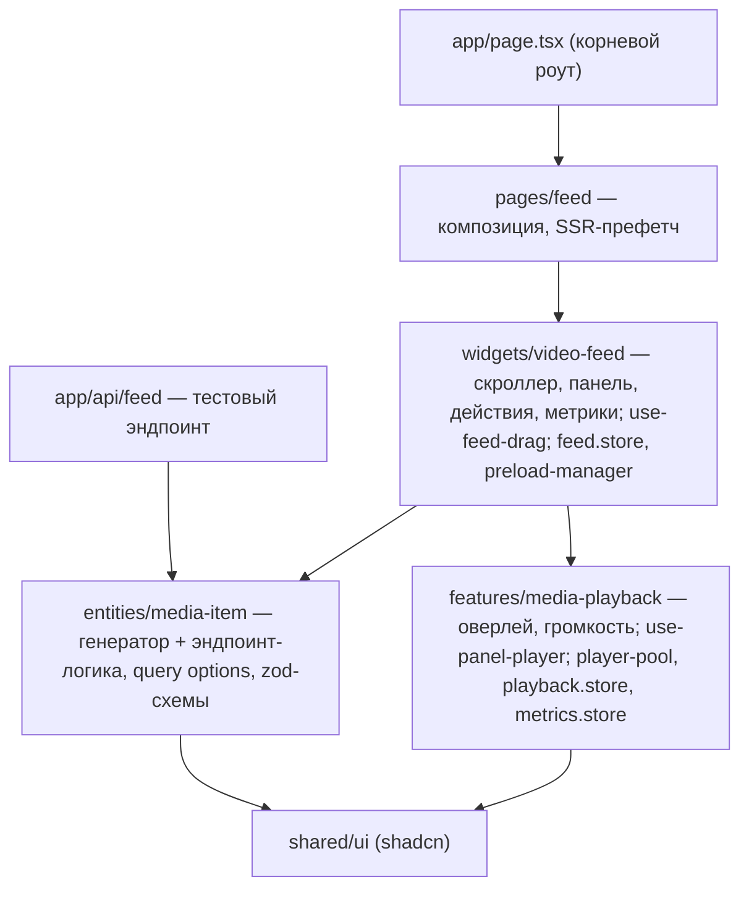
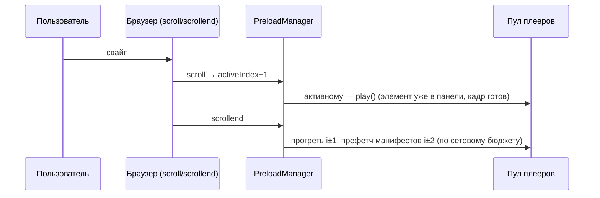

# Вертикальная видео-лента: технический план и прототип

Mobile-first лента коротких видео (аналог TikTok / Reels / Shorts): скролл по
одному элементу, автовоспроизведение активного, предзагрузка следующих.

**Это не только план — прототип реализован и развёрнут**:
**[tiktok.dealunloker.com](https://tiktok.dealunloker.com)** (метрики
воспроизведения — [`?debug=1`](https://tiktok.dealunloker.com/?debug=1)).
Лента — главная страница; в репозитории полный код: API, пул плееров,
предзагрузка, тесты.

## Решения в одну строку

| Область | Решение | Ключевая причина |
|---|---|---|
| Транспорт видео | HLS + `hls.js` (MSE / ManagedMediaSource) | ABR, контроль буфера до секунд/байтов, включая iPhone Safari 17.1+ |
| Плееры | Пул из 3 переиспользуемых `<video>` | Лимиты декодеров на мобильных; буфер MSE живёт в элементе |
| Механизм ленты | **Нативный CSS scroll-snap** | Жесты и инерцию обрабатывает браузер; ноль жестового кода |
| Виртуализация | Spacer-паттерн, окно ±3 | ≤7 узлов DOM при любой длине ленты; без замеров |
| Данные | TanStack Query `useInfiniteQuery` | Cursor-пагинация, SSR-префетч первой страницы |
| Клиентский стор | Zustand v5 | Атомарные селекторы; `getState()` в не-React колбэках |
| Жесты мыши | `@use-gesture/react` | Drag-to-scroll без самописного pointer-кода |
| Стили/UI | Tailwind v4 + shadcn | По требованиям шаблона проекта |

Стек-основа: Next.js 16 (App Router, React 19 + Compiler), TypeScript,
Feature-Sliced Design. Тесты: Vitest (36 юнитов) + Playwright (e2e на ленту).

---

## 1. Видео: плеер, форматы, буферизация

**HLS, а не прогрессивный MP4**: у MP4 нет адаптивного битрейта, и браузер сам
решает, сколько качать — стратегию предзагрузки на нём не построить. HLS даёт
сегменты по 2–4 с, ABR-лестницу и точный контроль буфера.

**`hls.js` напрямую, без плеер-обёрток** (vidstack/react-player/plyr отклонены:
прячут буфер-контроль, тянут ненужный UI). С v1.6 hls.js работает поверх
ManagedMediaSource — настоящий ABR на iPhone Safari, где TikTok web исторически
отдаёт голый MP4. Fallback — нативный HLS Safari; порядок проверок важен:
сначала `Hls.isSupported()`, потом `canPlayType` — Chrome отвечает `'maybe'` на
нативный HLS, но не играет его.

**Пул из 3 реальных `<video>`-элементов** (актив + два соседа) вместо элемента
на слайд. Причины: жёсткие лимиты одновременных декодеров на мобильных, и
главное — MSE-буфер привязан к элементу: перецепить hls.js на другой элемент =
буферить заново. Пул хранит элементы с их буферами; свайп назад — мгновенный
резюм.

Буферы по ролям: актив — 20 с / 12 МБ, сосед — 5 с / 4 МБ. Байтовый кап
обязателен: `maxBufferSize` по умолчанию 60 МБ, и на низкобитрейтных потоках
hls.js качает сотни секунд «мимо» секундного лимита.

Автоплей: `muted + playsInline`, звук по жесту (персистится). Отказ `play()`
классифицируется по `error.name`: только `NotAllowedError` — повод замьютить и
показать tap-to-play; `AbortError` при быстрой прокрутке не должен трогать
пользовательский выбор звука. `prefers-reduced-motion` отключает автоплей.

## 2. Механизм скролла

**Нативный браузерный скролл + CSS scroll-snap** (`snap-y mandatory`, панели
`100dvh` со `snap-stop: always`). Инерцию, физику и доводку выполняет браузер —
в приложении **ноль строк жестового кода**. Это же подход реальных
веб-реализаций TikTok-лент.

Путь к решению — осознанный и проверенный практикой. Кандидаты по ресёрчу:

- **Embla / shadcn Carousel** — нет виртуализации, деградация от ~500 слайдов;
- **Swiper Virtual** — каталог открытых багов ровно в нужной связке
  (vertical + Virtual + Mousewheel), React-обёртка деприкейтится;
- **Flicking (Naver)** — единственный со строгим «1 за жест» и ограниченным
  DOM; **был полностью реализован**. Тач работал отлично, но у ядра нет
  обработки колеса, а все мосты (плагин отсутствует в актуальной версии,
  подключение к внутреннему Axes, синтетический drag) требовали самописных
  эвристик по инерции macOS-тачпада и не давали стабильности. Вывод, ставший
  архитектурным принципом: **жесты колеса и тачпада должен обрабатывать
  браузер**.

Обвязка нативного скролла (тривиальная и стандартная):

- активный элемент: `round(scrollTop / clientHeight)` на `scroll`;
- «скролл остановился»: `scrollend` (baseline) + debounce-fallback;
- клавиатура: стрелки/PageUp/Down → `scrollBy({behavior: 'smooth'})`, Space —
  пауза (стандарт видеоплееров);
- drag мышью (нативный скролл его не даёт): `@use-gesture/react`, порог 15%
  высоты, снэп на время драга снимается и возвращается по `scrollend`.

## 3. Предзагрузка

Два независимых уровня.

**Данные**: `useInfiniteQuery`, cursor-пагинация по 10, догрузка за 4 элемента
до конца. Страницы append-only: метаданные копеечные (~300 байт/элемент),
а выпадение страниц сдвигало бы индексы панелей и спейсеров.

**Медиа** — `PreloadManager` поверх пула:

```ts
// на каждое изменение activeIndex / settled
pool.ensureActive(active)            // мгновенно, даже в полёте жеста
if (settled) debounce(100ms, () => { // соседи — только после остановки
  budget = navigator.connection?.saveData || effectiveType ∈ {2g,3g}
    ? 'data-saver' : 'normal'
  pool.applyWindow({ active, warm: budget === 'normal' ? [i+1, i-1] : [] })
  pool.setAutoLevelCap(budget === 'data-saver' ? 0 : -1)
  prefetchManifest(i±2)              // fetch в HTTP-кэш, с дедупом и abort
})
```

- Быстрый пролёт панелей не тратит сеть: тяжёлое — только после settle.
- Network-aware — progressive enhancement (API только в Chromium): дефолт
  консервативен для всех, Chromium с data-saver ужимается до одного видео.
- Полосу активному гарантирует малый буфер соседей. Явная пауза соседних
  загрузок при ребуфере активного была реализована и **снята**: `stopLoad()`
  до разбора манифеста замораживает hls.js необратимо — редкий случай, когда
  «оптимизация» опаснее проблемы.

## 4. Состояние

| Где | Что | Почему |
|---|---|---|
| React Query | страницы ленты | серверное состояние, SSR-префетч + гидрация |
| Zustand + `persist` | `muted`, `volume` (связаны: ноль = mute, дефолт 50%) | нужны всем панелям и пулу вне React |
| Zustand | `activeIndex`, метрики воспроизведения | атомарные селекторы — без каскадных ре-рендеров |
| Локально в панели | статус плеера (`loading/ready/playing/paused/blocked/error`) | колбэк из пула, никого больше не касается |

Кэш просмотренного: сегменты — в HTTP-кэше браузера (CORS-заголовки потоков
проверяются на этапе выбора источников); буфер последних видео — в элементах
пула (мгновенный свайп назад); Service Worker сознательно вне скоупа — при
живом HTTP-кэше выигрыш не окупает сложности инвалидации.

## 5. Производительность

**Виртуализация** — spacer-паттерн: два пустых div (`N × 100dvh`) + окно
реальных панелей `activeIndex ± 3` в нормальном потоке. Высоты одинаковые —
замеры не нужны, снэп-точки настоящие (готовые виртуализаторы конфликтуют со
scroll-snap — известная проблема transform-позиционирования). Сдвиг окна не
меняет высоту до текущей панели — позиция стабильна.

Бюджеты при 1000+ просмотров за сессию — всё константно:

| Ресурс | Бюджет |
|---|---|
| DOM-панели | ≤ 7 |
| `<video>`-элементы | 3 |
| Медиа-буферы | капы по ролям (см. §1) |
| Метаданные | единственное растущее: ~300 байт/элемент |

**Мгновенный кадр при свайпе**: сосед монтирует свой прогретый элемент пула
заранее (paused, кадр готов), вставка — в `useLayoutEffect` до первого paint,
и элемент не переизвлекается из DOM при смене роли (reparent = кадр-вспышка).
Итог: въезжающая панель видна с первого пикселя жеста.

**Ре-рендеры**: смена `activeIndex` перерисовывает только панели, входящие или
выходящие из окна (атомарные селекторы + React Compiler); прогресс/пер-кадровый
UI — принципиально мимо React (ref + rAF).

**Метрики** (`?debug=1`): TTFF, число и длительность ребуферов, dropped frames
из `getVideoPlaybackQuality()`.

**Проверено e2e** (Playwright, реальный Chromium): панелей ≤8 при навигации
через границы подгрузки, шаг строго «1 за жест», видео-бюджет соблюдён.

## 6. Что иначе, чем у TikTok / Reels / Shorts

1. **Честный data-saver**: TikTok web молча качает вперёд; здесь —
   консервативный дефолт и авто-ужатие окна на плохой сети.
2. **ABR на iOS-вебе** через ManagedMediaSource — у TikTok web там
   прогрессивный MP4 без адаптации.
3. **Доступность как фича**: полная клавиатура (стрелки, Space), aria-лейблы,
   `prefers-reduced-motion` — web-версии всех троих здесь провальны.
4. **Вес страницы**: headless-плеер + платформенный скролл на порядок легче
   бандлов соцсетей.
5. **Deep-links** (`/[id]` + SSR + OG-теги) — прямой следующий шаг
   архитектуры, у TikTok web работает полурабоче.

## Архитектура (FSD)





## Демо и проверка

- **[tiktok.dealunloker.com](https://tiktok.dealunloker.com)** — лента на 1200
  мок-элементов из 115 уникальных клипов (эндпоинт `GET /api/feed`,
  zod-валидация). Публичных HLS-потоков с CORS в природе ~десяток, поэтому
  уникальные элементы — виртуальная нарезка длинных потоков по стартовой
  позиции (`startPosition` hls.js): разные сцены, разные кадры.
- [`?debug=1`](https://tiktok.dealunloker.com/?debug=1) — TTFF / ребуферы /
  dropped frames.
- `pnpm test` — 36 юнитов: пул (гонки, LRU, ошибки, mute-политика),
  preload-manager (дебаунс, бюджеты, abort), сторы, генератор.
- `pnpm test:e2e e2e/feed-spike.spec.ts` — e2e ленты в реальном Chromium.

Известное ограничение прототипа: буферизация detached-элементов на физическом
iOS Safari не проверялась (нужно устройство); заложен fallback — прогрев в
скрытом DOM-контейнере.
